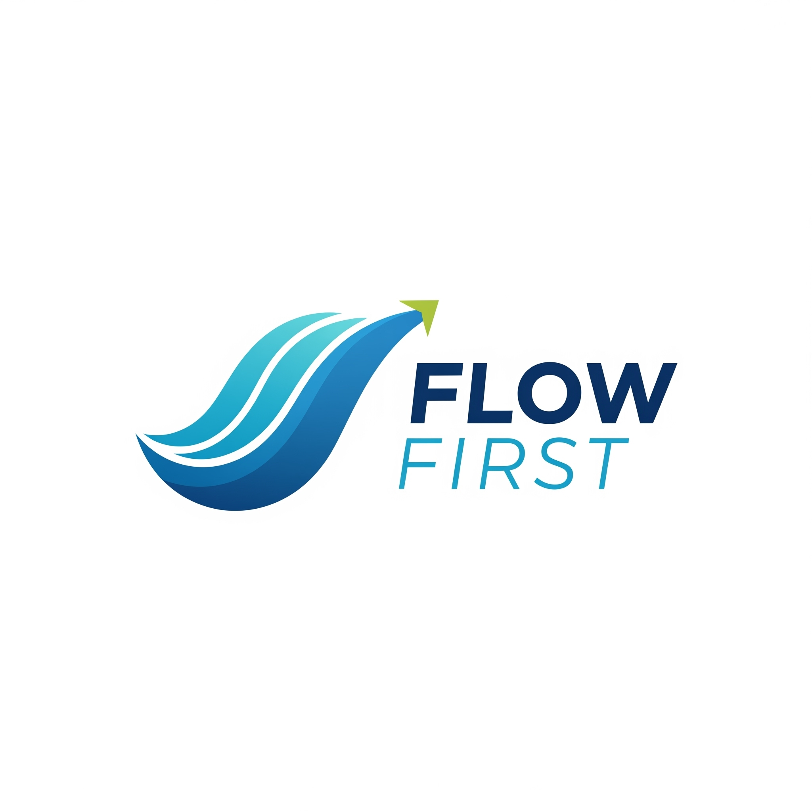

  

  # Flow First Development (FFD)

**Flow First Development (FFD)** is a project development methodology focused on building software in **strict sequential flow**, ensuring that **each step is functional and validated before moving to the next**.

Unlike iterative models that may jump between tasks, FFD prioritizes **dependency-driven progress**, guaranteeing that the **critical path** of the user flow is operational from day one.

---

## 🚀 Why FFD?
Modern software teams often waste time building features out of order.
FFD ensures:
- **Predictable progress** — no blocked features waiting on others.
- **Early usable product** — even if incomplete.
- **Dependency clarity** — you always know *what comes next*.
- **Ideal for AI-assisted development** — perfect for guiding AI tools step-by-step.

---

## 🔹 Core Principles
1. **Flow First** — always build in the order the user will experience it.
2. **Critical Path Focus** — skip secondary features until the main flow is complete.
3. **Sequential + Hierarchical** — handle nested flows in priority order.
4. **Milestone Validation** — every stage is user-validated before moving forward.

---

## 📊 Example
For a platform with:
- **Landing**
- **Login**
- **Admin Panel**
- **Client Panel**

FFD dictates:
1. Landing Page → 2. Login → 3. Admin Panel → 4. Client Panel.

The **Client Panel** depends on Admin data, so the Admin Panel must be ready first.

---

## 📂 Documentation
See the [`docs/`](docs/) folder for:
- [Repository Overview](docs/00-overview.md)
- [Introduction](docs/01-introduction.md)
- [Principles](docs/02-principles.md)
- [Advantages](docs/03-advantages.md)
- [Implementation Guide](docs/04-implementation.md)
- [Milestones](docs/05-milestones.md)
- [KPIs](docs/06-kpi-metrics.md)
- [Risk Management](docs/07-risk-mgmt.md)
- [Roadmap](docs/08-roadmap.md)
- [Case Studies](docs/09-case-studies.md)
- [FAQ](docs/10-faq.md)

---

## 🛠 Templates
Ready-to-use templates in [`templates/`](templates/) for:
- [Milestones](templates/milestone-template.md)
- [KPIs](templates/kpi-template.md)
- [Risk Assessment](templates/risk-template.md)
- [Roadmaps](templates/roadmap-template.md)
- [Project Brief](templates/project-brief-template.md)
- [Flow Tracker](templates/flow-tracker-template.md)
- [AI Integration](templates/ai-integration-template.md)

## 📖 Practical Guides
Step-by-step implementation guides in [`guides/`](guides/):
- [Getting Started](guides/getting-started.md)
- [AI Integration](guides/integrating-ai.md)
- [Common Pitfalls](guides/common-pitfalls.md)

## 🎨 Visual Assets
Professional resources in [`assets/`](assets/):
- Official FFD logo (SVG and PNG)
- Process diagrams and flowcharts
- Milestone tracking visualizations

## 📊 Examples
Real-world implementations in [`examples/`](examples/):
- [E-commerce Platform](examples/nimaproject/) - Basic FFD implementation
- [AI Content Assistant](examples/ai-app/) - AI-powered application
- [Learning Management System](examples/web-platform/) - Large team coordination
- [IoT Security System](examples/hardware-prototype/) - Hardware-software integration

---

## 📜 License
MIT License — Free to use, adapt, and share.

---

## 🤝 Contributing and Support
- See CONTRIBUTING.md for guidelines
- Open issues using our templates under .github/ISSUE_TEMPLATE
- For help, read SUPPORT.md

## 🔐 Security
For responsible disclosure, please read SECURITY.md.

---

*Repository configured and maintained by [@Rixmerz](https://github.com/Rixmerz)*

